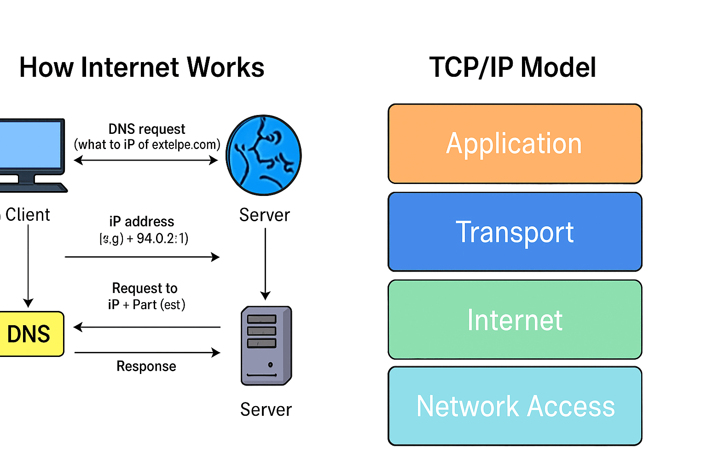

# 📘 Linux Basics for DevOps

This project covers the most essential Linux commands and concepts every DevOps engineer must know. Learn how to navigate the Linux file system, manage users and permissions, and execute powerful shell commands.

---

## 📂 Folder Structure

```
linux-basics-devops/
├── README.md
├── commands/
│   ├── navigation.sh
│   ├── file_management.sh
│   └── permissions.sh
├── users/
│   ├── add_user.sh
│   └── group_management.sh
├── diagrams/
│   ├── linux-architecture.png
│   └── linux-file-structure.png
```

---

## 📌 Key Topics Covered

### 🔹 1. Linux Architecture
- Kernel
- Shell
- Utilities
- Application Layer

📷 Diagram:  
   
    <p align="center">
        
    </p>

---

### 🔹 3. Navigation Commands
```bash
cd /path/to/dir
ls -l
pwd
```

---

### 🔹 4. File Management Commands
```bash
touch file.txt
mkdir folder
cp file1.txt file2.txt
mv file1.txt folder/
rm -rf folder/
```

---

### 🔹 5. Permissions & Ownership
```bash
chmod 755 script.sh
chown user:user file.txt
```

---

### 🔹 6. User & Group Management
```bash
adduser devops_user
usermod -aG sudo devops_user
groupadd devops_team
```

---

## 💻 Scripts Included

### 🔧 `commands/`
- `navigation.sh` → Basics like `cd`, `ls`, `pwd`
- `file_management.sh` → Create, move, delete files
- `permissions.sh` → Manage file permissions

### 👤 `users/`
- `add_user.sh` → Add user with password
- `group_management.sh` → Add/remove groups

---

## 🧠 Useful for:
- DevOps Engineers
- Cloud Engineers (AWS, Azure, GCP)
- Linux Admins
- Students learning Linux

